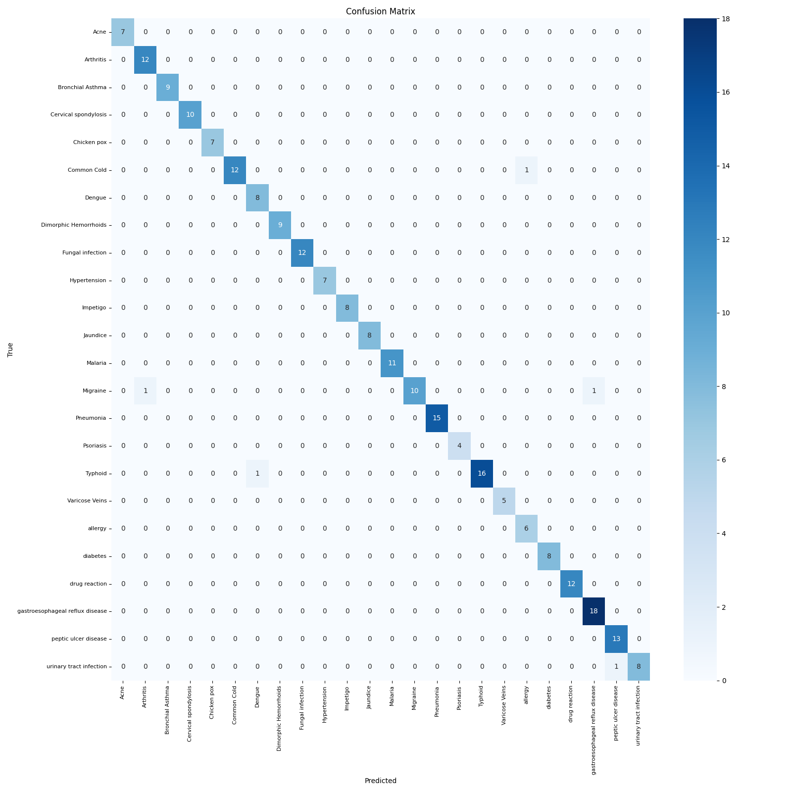

# 🩺 Task 1: Symptom Analysis — Disease Classification from Text

## 🧠 Objective

Build a Natural Language Processing (NLP) model that can predict a disease based on a free-text symptom description — simulating a key capability of a healthcare assistant.

---

## 📦 Dataset

- Source: [Kaggle — Symptom to Disease Dataset](https://www.kaggle.com/datasets/niyarrbarman/symptom2disease)
- Size: ~1200 rows
- Each row contains:
  - `text`: A string of symptom keywords
  - `label`: The diagnosed disease

> 📝 *Example row:*
> ```
> text: "I have been experiencing a skin rash on my arms, legs, and torso for the past few weeks. It is red, ..."
> label: "Psoriasis"
> ```

---

## 🧪 Methodology

### 🛠 Preprocessing
- Removed rows with missing data(This is a normal procedure, in this case there were none)
- Converted symptom text to numerical features using **TF-IDF Vectorization**(as this was a normal NLP task, but could have been better implemented with a Deep Neural Network)

### 🤖 Model
- Trained a **Logistic Regression** classifier using scikit-learn
- Split dataset into **80% train / 20% test**
- Evaluated with **Accuracy**, **Precision**, **Recall**, and **Confusion Matrix**

---

## 📊 Results

| Metric     | Value         |
|------------|---------------|
| Accuracy   | ~97%          |
| Precision  | Varies by class(high across most classes) |
| Confusion Matrix | See below 📉 |

### 🔍 Confusion Matrix  


> Some diseases are frequently confused due to symptom overlap (e.g. fever, fatigue across flu, dengue, COVID).

---

## ⚠️ Limitations

- The dataset includes a limited set of diseases (~22 total), so predictions may fail for symptoms outside this scope. The model seems to perform well on the given dataset because of its small corpus, but out of the corpus, its knowledge will be limit, so don't take it as a generalized model, for that task we would require a Deep Neural Network.
- Example: entering "back pain" resulted in incorrect predictions like "diarrhoea" — because musculoskeletal conditions are underrepresented.
- The model does **not understand natural conversation**, only symptom keywords.

---

## 🚀 How to Run

### 🧪 Set up virtual environment
```bash
python -m venv venv
source venv/bin/activate  # on macOS/Linux
venv\Scripts\activate     # on Windows